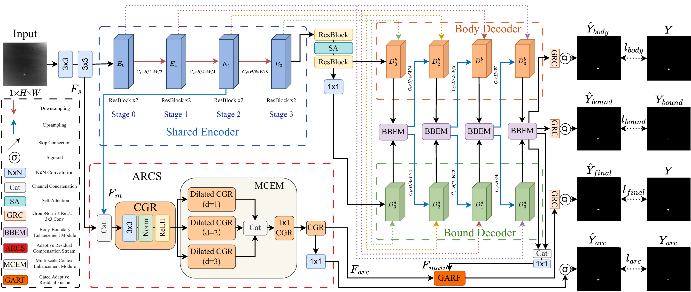

<div align="center">

# BCR-Net

### Body-Boundary Collaboration with Adaptive Residual Compensation for Infrared Small Target Detection

[](https://doi.org/10.1109/TGRS.2026.3730041)
[](https://pytorch.org/)
[](LICENSE)

Official PyTorch implementation.

Jiaxuan Li, Yao Liu, Yuewei Xue, Ruixiang Wen, Jiaqi Li, Yuhui Xian, Jun Xie, and Qiao Liu

*IEEE Transactions on Geoscience and Remote Sensing*, 2026

</div>

This repository is largely based on [BasicIRSTD](https://github.com/XinyiYing/BasicIRSTD). We thank its authors for making their code publicly available.

## Architecture

<p align="center">
  
</p>

## Requirements

```bash
conda create -n bcrnet python=3.10
conda activate bcrnet
pip install -r requirements.txt
```

## Dataset

BCR-Net is evaluated on five public infrared small target detection datasets:

- [NUAA-SIRST (SIRST v1)](https://github.com/YimianDai/sirst): real-world single-frame infrared images collected from diverse scenes.
- [NUDT-SIRST](https://github.com/YeRen123455/Infrared-Small-Target-Detection): a synthetic benchmark containing targets with varied shapes, sizes, and backgrounds.
- [IRSTD-1K](https://github.com/RuiZhang97/ISNet): 1,001 realistic infrared images with pixel-level annotations.
- [SIRST-V2](https://github.com/YimianDai/open-sirst-v2): an extended real-world benchmark with more diverse scenes and target characteristics.
- [WideIRSTD-Full](https://github.com/XinyiYing/WideIRSTD-Dataset): a large-scale multi-domain benchmark covering varied resolutions, spectral bands, and imaging platforms.

Arrange each dataset as follows:

```text
datasets/IRSTD-1K/
├── images/
├── masks/
└── img_idx/
    ├── train_IRSTD-1K.txt
    └── test_IRSTD-1K.txt
```

Each index file contains one image identifier per line.

## Citation

If you find our work interesting and useful, please consider citing our paper:

```bibtex
@ARTICLE{11677204,
  author={Li, Jiaxuan and Liu, Yao and Xue, Yuewei and Wen, Ruixiang and Li, Jiaqi and Xian, Yuhui and Xie, Jun and Liu, Qiao},
  journal={IEEE Transactions on Geoscience and Remote Sensing},
  title={BCR-Net: Body-Boundary Collaboration with Adaptive Residual Compensation for Infrared Small Target Detection},
  year={2026},
  volume={},
  number={},
  pages={1-1},
  doi={10.1109/TGRS.2026.3730041}
}
```

## License

This project is released under the [MIT License](LICENSE).
